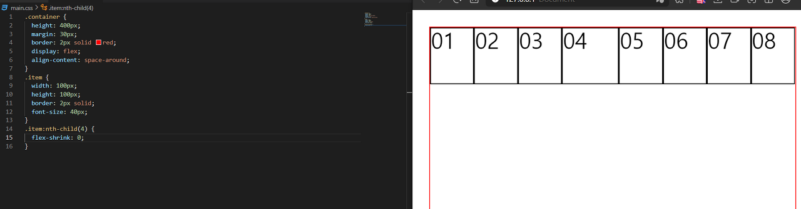
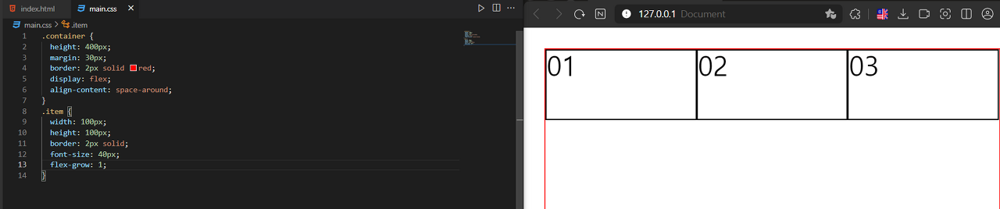
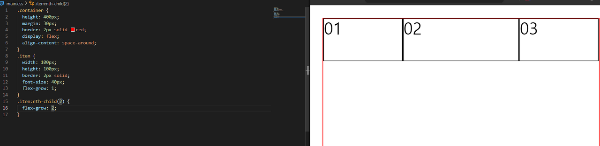
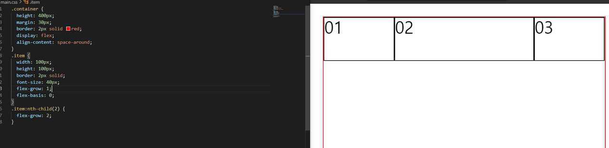

# **Flex**

1차원 레이아웃을 만들 때 사용하는 기술

2차원 레이아웃을 만들 때는 `gird`를 사용한다

1차원은 당연하게 기준이 하나이다

`flex`는 하나의 축으로 기준을 잡는다
 
 

## **flex-container**

### **flex-direction**

주 축을 x로 할 건지, y로 할 건지 설정할 수 있다

`row`, `row-reverse`, `column`, `column-reverse`를 값으로 설정할 수 있다
 
 

### **flex-wrap**

`flex`는 줄 바꿈이 기본이 아니다.! 한 줄에 콘텐츠가 넘쳐도 무조건 압축시켜서 밀어 넣게 된다.

즉 기본값이 `flex-wrap: nowrap`인데, `flex-wrap: wrap`으로 설정하면 줄 바꿈을 할 수 있다

`nowrap`, `wrap`, `wrap-reverse`를 값으로 설정할 수 있다
 
 

**justfy-content**

`content`를 정렬하는 방식을 지정하는 것이다. 수평으로 나열된 `items`를 가운데로 모을지, 오른쪽으로 밀어버릴지 같은 값을 설정할 수 있다

`flex-start`, `flex-end`, `center`, `space-between`, `space-around`를 값으로 설정할 수 있다
 
 

**align-items**

한 줄을 수직 정렬하는 방식을 지정하는 것이다

`stretch`, `flex-start`, `flex-end`, `center`, `baseline`을 값으로 설정할 수 있다

기본 값이 `stretch`인데, 이것을 중요하게 봐야 한다

`items`의 높이가 지정되지 않은 경우, `align-items`의 기본값이 `stretch`이기 때문에 늘어나는 것을 볼 수 있다!
 
 

**align-content**

두 줄 이상을 수직 정렬하는 방식을 지정하는 것이다

`stretch`, `flex-start`, `flex-end`, `center`, `space-between`, `space-around`를 값으로 설정할 수 있다
 
 

## **flex-items**

당연하게도, 앞 서 기재한 `flex-container`에서 사용하는 속성들은 `flex-items`에는 적용할 수 없다.

`flex-container`와 `flex-items`의 차이를 아는 것은 매우 중요하다
 
 

**order**

숫자가 크면 클수록 해당 요소는 뒤로 밀린다

기본 값은 0이며, 음수도 가능하다

단 주의할 점은 보이는 순서만 뒤로 밀리는 것이며, 구조적인 순서는 바뀌지 않는다

4번 `item`이 가장 뒤로 밀렸지만(보이는 순서) 드래그를 해보면 5번 요소가 드래그됨과 동시에 4번 요소가 드래그되는 것을 볼 수 있다. 즉 구조적인 순서는 바뀌지 않았음을 확인할 수 있다
 
 

**flex-shrink**

감소 너비 비율을 의미한다

기본 값이 1인데, 이는 감소할 수 있음을 의미한다.

바로 위에 사진을 보면, `item`들이 설정한 크기보다 작게 찌그러진 걸 볼 수 있다

4번만 찌그러지지 않는 걸 볼 수 있다, 4번 `item`의 `flex-shrink`값을  `0`으로 설정했기 때문이다

0과 1 즉 감소하냐, 안 하냐 상태만 있다고 생각하면 된다
 
 

**flex-grow**

증가 너비 비율

앞서 나온 감소 너비 비율을 생각하면 된다

`item`들이 늘어나는 것을 볼 수 있다. 기본값은 0이며, 1은 늘어날 수 있는 값을 주는 것이다

비율을 설정할 수 도 있는데, 잘 보면 1 : 2 : 1로 설정했지만, 해당 비율이 아닌 것을 확인할 수 있다.

그 이유는 `flex-basis`을 살펴보면 된다
 
 

**flex-basis**

`ltem`의 기본 너비를 의미하며 기본 값은 `auto`로 우리가 설정한 너비가 들어가게 된다

즉 앞서 살펴본 예시에서는 기본 너비 `100px`을 제외하고 남은 값이 1 : 2 : 1로 들어간 것이다

`flex-basis: 0`으로 설정하니, 기본 너비 없이 1 : 2 : 1로 설정된 것을 확인할 수 있다
 
 

**align-self**

개별 `item`에 대한 수직정렬을 만든다

2번 요소만 위로 올라간 걸 볼 수 있다