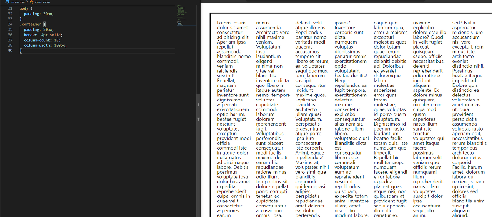

# **다단 만들기**

```css
.container {
  padding: 20px;
  border: 4px solid;
  
   /* 단의 최종 개수 */
  column-count: 10;
  
   /* 각 단의 최종 너비 */
  column-width: 100px;
  
   /* 단 사이의 여백 */
  column-gap: 200px;
  
   /* border와 같은 선 */
  column-rule: 1px solid red;
}
```

단의 개수를 설정한다고 해서, 단이 원하는 대로 다 만들어지는 건 아니다!

내가 설정하는 건 최대 개수이다!



단의 개수를 10으로 설정했지만,

브라우저가 알아서 최적화를 시킨 걸 확인할 수 있다!

결론은 브라우저가 알아서 최적화를 시킨다를 아는 것이 가장 중요하다!!

단의 최종 너비와 최종 개수를 지정만 할 수 있다
