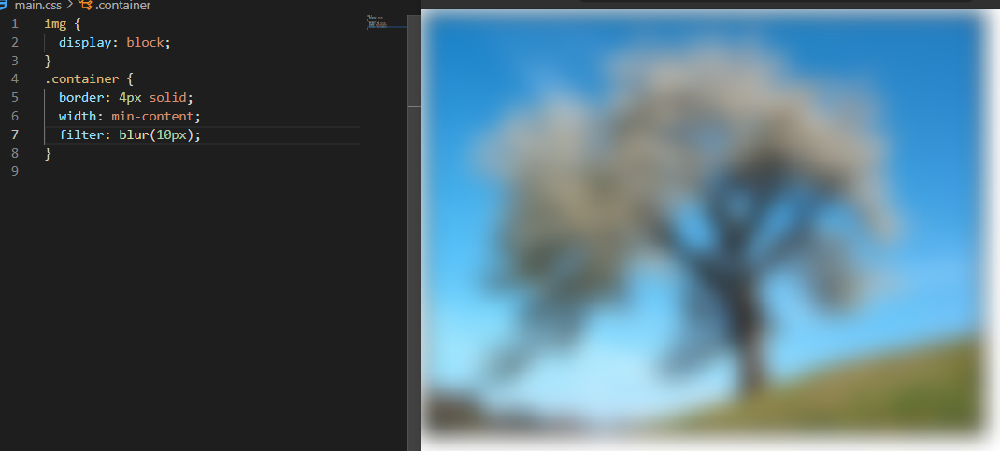

# **Filter**

```css
.container {
  filter: blur();
  filter: brightness();
  filter: contrast();
  filter: drop-shadow();
  filter: grayscale();
  filter: hue-rotate();
  filter: invert();
  filter: opacity();
  filter: saturate();
  filter: sepia();
}
```

모든 속성이 다 많이 쓰이는 것은 아니다

`blur`, `grayscale`, `invert`정도만 잘 이해하면 된다



`blur` - 흐림 처리
<br>
<br>


`grayscale` - 기본값이 100%이다
<br>
<br>

많이 쓰는 속성은 `blur`, `grayscale`, `invert`(반전 효과) 정도이다


`backdrop-filter`는 필터에서 쓸 수 있는 속성이 들어갈 수 있는데, 해당 부분이 필터가 적용되는 것이다
