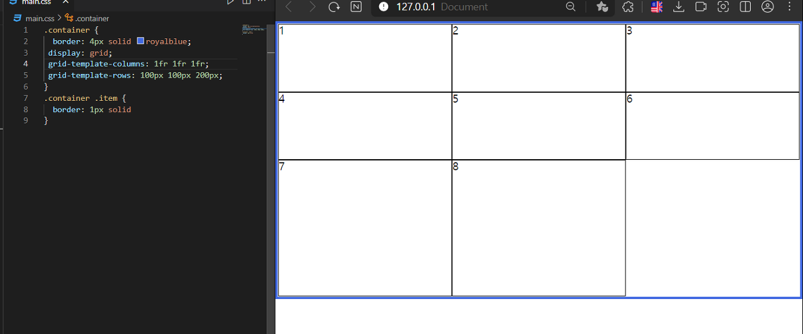
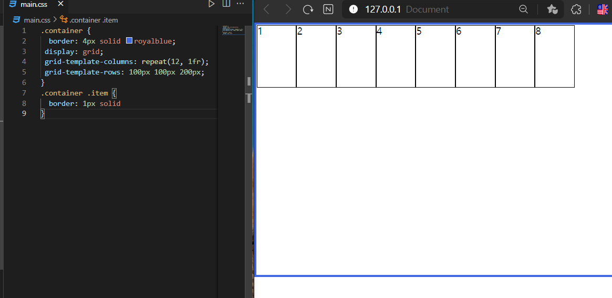
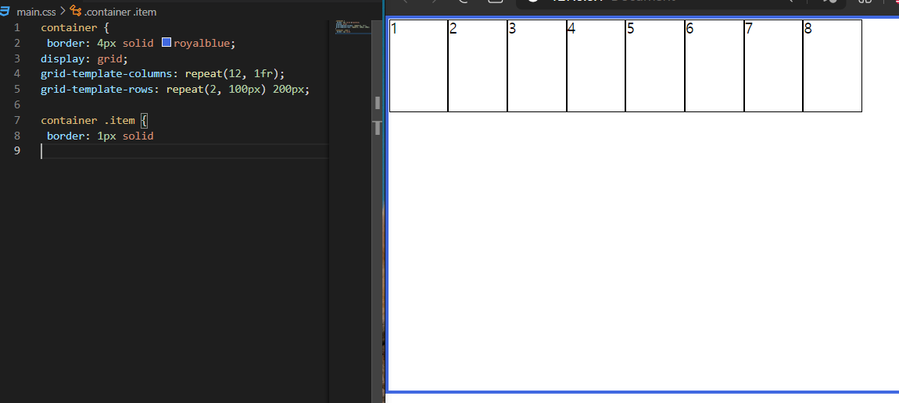
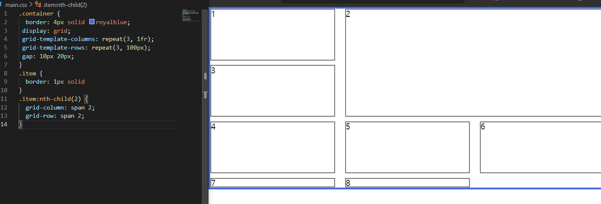
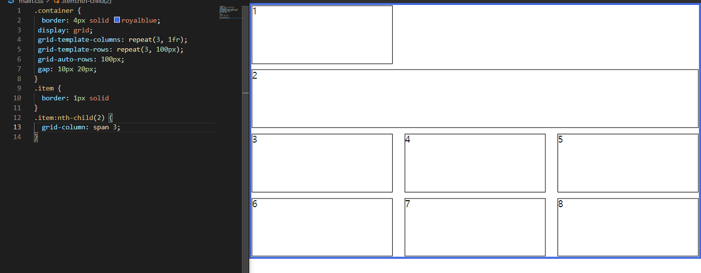
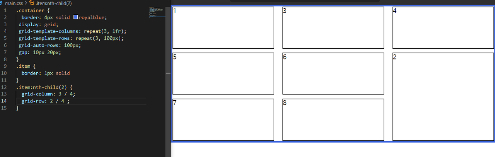
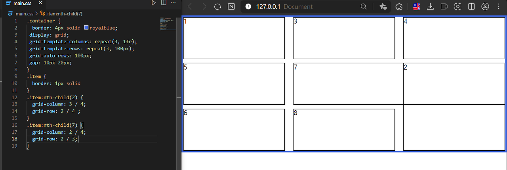
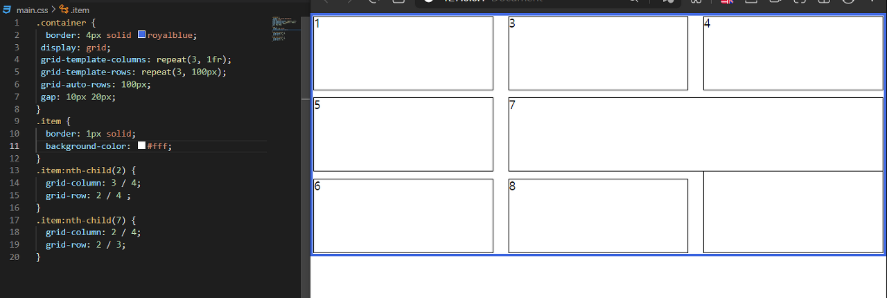
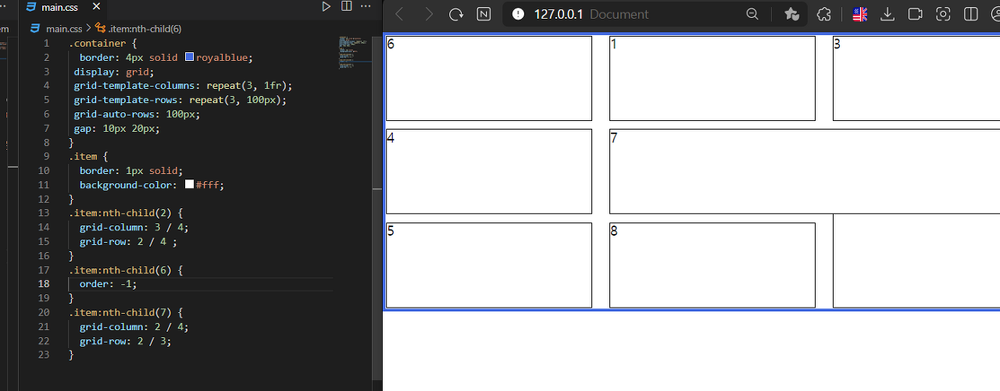

# **grid**

`flex`와 같이 `grid`도 `grid-container`, `grid-items`로 나뉜다

`flex`는 1차원의 레이아웃, `grid`는 2차원의 레이아웃이다
<br>
<br>

## **grid-template-columns,** **grid-template-rows**

```css
.container {
  display: gird;
  grid-template-columns: 1fr 1fr 1fr;
  grid-template-rows: 1fr 1fr 1fr;
}
```


이렇게 하면 3행 3열이 만들어진다

`grid`를 만들면 가장 먼저 해야 하는 것은 이렇게 `rows`와 `columns`의 개수를 정해서 만들어 주는 것이다


`grid`에서는 비율단위로 `fr(fraction)`을 사용한다





비율 단위를 사용하게 되면 이렇게 여백이 없어진다




`repeat(만들 개수, 비율)`를 사용하면 편하게 만들 수 있다




이렇게 `repeat`와 다른 비율을 섞을 수 있지만, 이렇게는 잘 안한다

중요한 건, 각각의 아이템이 하나도 없어도, `grid` 시스템은 유지되고 있다

하나의 방을 cell이라고 하는데, 해당 cell이 채워져있지 않을 뿐이지 존재하고 있다

개발자 도구에서 컨테이너 요소를 보면 확인할 수 있다
<br>
<br>

## **Track, Line, Cell, Area**

트랙(Track)은 하나의 행 혹은 하나의 열을 의미한다

라인(Line)은 일반적으로 거터(Gutter)라고 하는 트랙과 트랙사이의 여백(간격)을 의미한다

셀(cell)은 하나의 칸을 의미한다, 아이템이 아니다! 아이템이 배치되는 하나의 공간이 셀이다!!

영역(Area)은 셀 여러개를 의미한다
<br>
<br>

## **gap**

```css
.container {
  gap: 10px 20px;
}
```

항상 말할 때, 행과 열 순서로 말하는 걸 상기해보면 된다

`gap` 단축 속성의 순서는 `(row사이의 간격) (column사이의 간격)`을 의미한다

`flex`에서도 `gap`속성을 사용할 수 있기 때문에 `grid-gap`으로 쓰지 않고, `gap`이라고 적는다!
<br>
<br>

## **span**

`grid`에서 `span`은 확장의 의미를 가진다

```css
.item:nth-child(2) {
  grid-column: span 2;
}
```

이런 경우 아이템 2번의 `column`이 차지하는 공간은 2가 된다

즉 `grid-column` 방향으로 두 개의 셀을 점유하게 된다


앞서 말했듯이, `grid`는 `container`와 `items` 구조로 만들어서, 현재 `container`를 몇 행의 몇 열의 `grid` 구조로 만들 것인지 정의하는 것이 첫 번째 단계이고, 그다음은 그 구조 안에서 여러 가지 아이템을 배열하는 것이 핵심 개념이다!
<br>
<br>

## **grid-auto-rows/columns**




7, 8번 아이템이 잘리는 문제가 발생한다

실제로 잘린 것은 아니고, 높이값은 어떤 상황에서던지 항상 줄어들으려고 하기 때문에, 요소의 크기만큼 줄어든 것이다

이러한 상황을 막기 위해서

```css
.container {
 grid-auto-rows: 100px;
}
```

이렇게 적용하면, 넘치는 요소의 처리를 지정할 수 있다


이러한 이유로, `rows` 같은 경우 `template` 속성은 잘 쓰지 않고, `auto`를 많이 사용한다

`template` -> 명시적으로 행과 열을 지정

`auto` -> 암시적으로 행과 열을 지정

이렇게 생각하면 된다
<br>
<br>

## **grid-auto-flow**




1번 아이템 옆으로 빈 공간이 있는 걸 볼 수 있다


```css
.container {
  grid-auto-flow: column dense;
}
```

이렇게 지정하면, `column` 방향으로 돌아가다가, `dense(빽빽한, 밀집)` 속성으로 인해 채워진 것이다

`row dense` 같은 경우, 앞에 `row`를 생략하여 `dense`만 적어도 된다
<br>
<br>

## **grid-row/column: 숫자 / 숫자;**

각각의 line에는 번호가 있고, 이런 식으로 배치할 수 있다





2번 아이템이

`column` 기준 3번째에서 시작해서 4번째 라인에서 끝나는 cell을 점유하였고,

row 기준 2번째에서 시작해서 4번째 라인에서 끝나는 cell을 점유하였다

이렇게 자리를 옮길 수 있다
<br>
<br>

## **Z-index**



이렇게 하면 중첩이 되는데



나중에 작성된 아이템이 더 나중에 쌓여서 위에 나온 걸 볼 수 있다

즉 2번 아이템보다 7번 아이템이 더 나중에 쌓인 것이므로, 올라와있지만,

`z-index`를 사용하면 2번 아이템을 7번 아이템 위로 올릴 수 있다
<br>
<br>

## **order**




6번째 아이템에 `order: -1`을 넣었더니, 가장 앞으로 배치된 걸 볼 수 있다

`order`는 숫자가 작을수록 우선순위가 높다

기본값은 0이다
