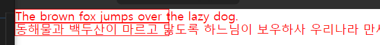
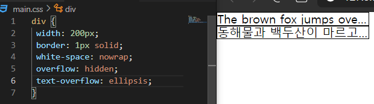
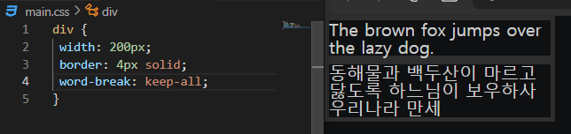

# **말줄임표**

```css
/* white-space: nowrap = 감싸지 않는다 */
/* overflow: hidden = 넘친 부분을 잘라낸다 */
/* text-overflow: ellipsis = 잘라낸 부분을 기준으로 말줄임표가 만들어진다 */
div {
  width: 100px;
  border: 1px solid;
  white-space: nowrap;
  overflow: hidden;
  text-overflow: ellipsis;
}
```



`white-space: nowrap`을 적용하게 되면, 요소의 크기를 벗어나더라도 감싸지 않게 된다



말줄임표가 생긴 걸 볼 수 있다

<br>
<br>


# **word-break: keep-all**

영어와는 다르게, 한글은 줄바꿈 처리될 때, 단어 단위로 되지 않는다

그럴 때 이 속성을 사용해주면 단어 단위로 줄 바꿈 처리할 수 있다




# **overflow-wrap: break-word**

아주 긴 단어 ex) abcdefghijklmn... 이런 형식으로 띄어쓰기되어있지 않은 문장은 줄 바꿈 처리가 되지 않는다. 

이 속성을 사용하면 요소의 너비에 맞추어서 줄 바꿈 처리를 해준다
