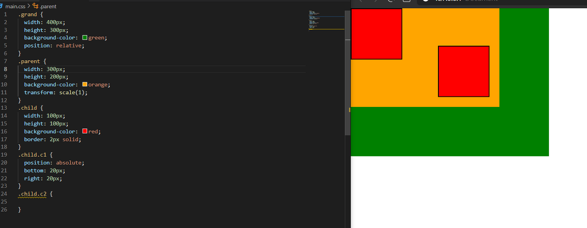

# **Position(요소의 위치 지정 기준)**

position 값은 총 5개가 있다
- `static`
- `relative`
- `absolute`
- `fixed`
- `sticky`
 
 

## **static**

`none`과 비슷하다고 생각하면 된다. `position`의 동작을 사용할 수 없는 상태이다
 
 

## **relative**

요소가 자기 자신을 기준으로 배치된다

즉 주변 요소에 영향을 끼치지 않는다

이 값으로 어떠한 요소를 움직이게 하는 경우는 거의 없다

위치상의 부묘요소 기준으로 잡는 경우에 대부분 사용된다
 
 

## **absolute**

위치상 부모요소 기준으로 움직이겠다!라고 선언하는 것이다

주의할 점은 기준이 구조적인 부모 요소가 아닌! 위치상의 부모 요소이다

오른쪽 아래에 보면 `child c1`이 부모 요소인 `parent`가 아닌, `relative` 속성이 부여된 `grand` 기준으로 자리 잡은 걸 볼 수 있다!

또한 요소의 조상 중 하나가 `transform`, `perspective`, `filter` 속성 중 어느 하나라도 `none`이 아니라면, 그 조상을 컨테이닝 블록으로 삼게 된다!

원래 대로라면 `grand`가 `relative` 값을 가지고 있기 때문에 `child c1`은 `grand` 기준으로 배치되어야 하지만, `parent`에 `transform` 값이 `none`가 아니기 때문에! `parent`를 컨테이닝 블록으로 삼게 되어, 즉 위치상 부모 요소로 삼게 되어 `parent`기준으로 배치된 것을 볼 수 있다
 
 

## **fixed**

뷰포트 기준으로 요소가 고정이 된다

앞서 `absolute`와 마찬가지로, 요소의 조상(상위 요소) 중 하나가 ` transform`, `perspective`, `filter` 속성 중 어느 하나라도 `none`이 아니라면, 그 조상을 컨테이닝 블록으로 삼게 된다! 즉 뷰포트 기준으로 고정이 안되게 바뀐다는 것
 
 

## **sticky**

가장 가까운 조상 **스크롤 박스**에 달라붙는다 (통상적으로 뷰포트)

가장 가까운 블록 조상(통상적으로 부모) 요소 **범위 안에서만** 움직인다

만약 부모 요소가 블록 요소가 아니라면, 조상 요소로 올라가지만, 통상적으로 레이아웃을 잡을 때, 부모 요소가 블록이 아닌 경우가 거의 없다.! 때문에 보통 부모 요소 범위 안에서만 움직인다고 기억하면 된다

달라붙어서, 부모 요소 (orange 범위) 까지만 따라온 걸 볼 수 있다

`top: 0` 은 즉 부모 요소의 위에 붙고, `left: 0` 왼쪽에 붙는다는 걸 알 수 있다
