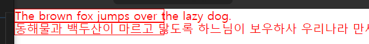
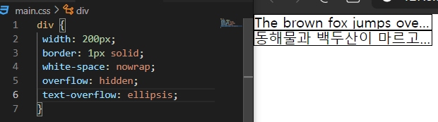
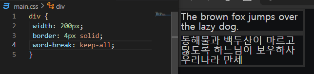
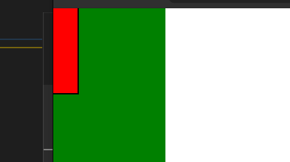

# **HTML 부모 요소와 자식 요소**

```html
<!-- h1 요소 기준, div는 부모요소, body는 상위요소 -->
<!-- 최상위 요소는 html이다 -->
<body>
  <div>
    <h1></h1>
  </div>
</body>
```

# **태그(Tag) & 요소(Element)**

## **태그와 요소의 차이**

```html
<!-- div 태그 -->
<div>
<!-- div 요소 -->
<div></div>


<!-- 요소는 시작 태그와 종료 태그로 이루어져있다 -->
```

## **img 태그**

```html
<!-- source src="넣을 이미지의 주소" -->
<!-- alternate alt="대체 텍스트" -->

```

## **빈(empty) 태그**

```html
<!-- html5 에서는 2가지 빈태그 문법을 사용 할 수 있다 -->
<!-- /를 붙이는게 허용되는 버전도 있고, 안되는 버전도 있다, 문법적으로는 문제X-->
<!-- 일관성 있게 작성할 것, img는 빈태그이다 -->
 or 
```

## **div 태그**

div 태그는 의미가 없는 태그이다

```html
<header>
<div>
<!-- 구조적으로 차이가 없다 -->
<!-- 의미적으로 나누는 태그 -->
```

## **span 태그**

div 태그와 마찬가지로 의미가 없는 태그이다<br>

다만 div와 span 태그의 차이는 block, inline 으로 나뉜다
<br>
<br>

## **block 요소 vs inline 요소**
<br>
block 요소는 기본적으로 layout을 잡기 위한 용도이다

화면에 보이는 구조, 글자가 아닌 구조를 만드는 데에 block 요소가 쓰인다

반면, 화면에 보이는 글자는 inline 구조로 관리를 한다

가장 큰 차이는 div는 display라는 css 속성의 default값이 block으로 들어가 있고,

span은 display의 default값이 inline이다

```html
<!-- display: block -->
<!-- block 요소는 너비가 최대한 늘어나려고 한다 -->
<div></div>

<!-- display: inline -->
<!-- inline 요소는 너비가 요소의 크기만큼 줄어든다 -->
<span></span>


<!-- block, inline 둘 다 세로의 크기의 default 값은 0이다 -->
```


# **전역(전체 영역, -global) 속성**
<br>
전체 영역, 모든 html 태그에 사용할 수 있는 속성을 의미한다

src 속성은 전역 속성일까? 아니다, 즉 div에는 src를 적용하면 안 된다

대표적으로 title, class, id, data 등이 있다
<br>
<br>

# **Class**

쉽게 생각해서, 태그에 이름을 부여해준다

```html
<!-- tistory 클래스를 부여했다 -->
<div class="tistory"></div>
```

## **왜 사용하나?**

```html
<div class="test">hello</div>
```

```css
/* hello 라는 글자의 색을 red로 바꿀 수 있다 */
.test {
  color: red;
}
```

## **html과 css를 연결하는 방식**

```html
<!-- head 안에 link 태그를 넣어주는 방식 -->
<!-- link는 외부에 존재하는 특정 파일에 링크를 거는 것 -->
<!-- 여기서는 상대경로(./)에서 main.css 파일을 가져왔다 -->
<link rel="stylesheet" href="./main.css">


<!-- 내장하는 방식 -->
<style>
  [title="hello"] {
    color: red
  }
</style>

<!-- 이런 inline 방식은 선택자 라는 방식을 적용 할 필요가 없지만,
이것이 굉장히 큰 단점이 된다 -->
<body>
  <div class="hello" style="color: red">1234</div>
</body>
```

```css
@import url("./sub.css")
```

위와 같은 방식을 import 방식이라 하는데, link 방식은 병렬연결이다. 

때문에 받아오는 속도는 빠르지만, 어떤 파일이 먼저 올 지 모른다는 것이다.

```html
<head>
<link rel="stylesheet" href="./main.css">
<link rel="stylesheet" href="./sub.css">
</head>
```

만약 이렇게 두 개의 css 파일이 연결될 때,

main.css 파일 안에는 sub.css 파일에 영향을 주는 정보가 있다고 생각해보자.

병렬 방식인 link 방식으로 들어오게 될 때, sub.css 파일이 먼저 들어오게 되면 에러가 발생하게 된다

import 방식은 main.css안에 적용하여서, main.css 가 먼저 index.html로 들어오고,

그 뒤에 sub.css가 적용되기 때문에 에러가 발생하지 않는다
<br><br>

## **div: vs div::**

```
/* : 1개는 가상 클래스 선택자*/
div:nth-child()

/* :: 2개는 가상 요소 선택자*/
div::after
```


# **Margin collapsing**

1\. 부모(상위) 요소의 margin-top과 자식(하위) 요소의 margin-top이 겹쳐있으면 collapsing이 일어난다

2\. 이전 형제 요소의 margin-bottom과 다음 형제 요소의 margin-top이 겹쳐있으면 collapsing이 일어난다

\*단 margin collapsing은 좌, 우로는 발생하지 않고, 위, 아래에서만 발생한다

```css
/* margin collasing 1번 예시 */
.parent {
  width: 200px;
  height: 200px;
  background-color: orange;
}
.child  {
  width: 100px;
  height: 100px;
  background-color: red;
  margin-top: 20px;
}
```


child 요소에만 margin-top 이 20px 들어가 있는데, 부모 요소에도 함께 적용된 걸 볼 수 있다
<br>
<br>


# **box-sizing**

box는 기본적으로 block요소를 의미

padding(내부 여백)을 쓰면 마치 풍선에 바람을 넣는 것과 같이 요소의 크기가 증가하게 된다

```css
.child  {
  width: 100px;
  height: 100px;
  background-color: red;
  padding-top: 20px;
}
```

box-sizing의 default 값은 content-box로, 요소의 내용으로 크기를 계산하는데, 

문제점은 이럴 경우 padding-top: 20px로 인하여 요소의 크기는 우리가 설정한 100px이 아닌, 120px로 들어가게 된다

```css
.child  {
  width: 100px;
  height: 100px;
  background-color: red;
  padding-top: 20px;
  box-sizing: border-box;
}
```

그래서 box-sizing: border-box;으로 지정해주면 요소의 내용과 padding, border를 합친 크기로 계산하기 때문에 우리가 예상하는 값을 얻을 수 있다

실제로 padding-box라는 값이 존재하지는 않지만 의미적으로 생각하며,

content-box -> padding-box -> border-box  순으로 커지는 의미를 이해하고 있으면 좋다
<br>


# **간격**

```css
div {
  letter-spacing: 10px;
}

.second {
  word-spacing: 20px;
}
```

letter-spacing: 글자와 글자 사이의 간격

word-spacing: 단어와 단어 사이의 간격
<br>
<br>


# **말줄임표**

```css
/* white-space: nowrap = 감싸지 않는다 */
/* overflow: hidden = 넘친 부분을 잘라낸다 */
/* text-overflow: ellipsis = 잘라낸 부분을 기준으로 말줄임표가 만들어진다 */
div {
  width: 100px;
  border: 1px solid;
  white-space: nowrap;
  overflow: hidden;
  text-overflow: ellipsis;
}
```



white-space: nowrap을 적용하게 되면, 요소의 크기를 벗어나더라도 감싸지 않게 된다



말줄임표가 생긴 걸 볼 수 있다

<br>
<br>


# **word-break: keep-all**

영어와는 다르게, 한글은 줄바꿈 처리될 때, 단어 단위로 되지 않는다

그럴 때 이 속성을 사용해주면 단어 단위로 줄 바꿈 처리할 수 있다




# **overflow-wrap: break-word**

아주 긴 단어 ex) abcdefghijklmn... 이런 형식으로 띄어쓰기되어있지 않은 문장은 줄 바꿈 처리가 되지 않는다. 

이 속성을 사용하면 요소의 너비에 맞추어서 줄 바꿈 처리를 해준다

<br>
<br>

# **text-indent: -9999px**

text-indent는 들여쓰기를 의미한다

img를 css 상에서 불러와서 대체 텍스트를 적용하고 싶을 때, 즉 alt를 사용하지 않을 때 대체 텍스트는 어떻게 나타낼까?

div 상에서 텍스트를 적은 뒤, 해당 요소를 선택한 뒤 text-indent: -9999px를 적용하면, 보이진 않지만 존재는 하기 때문에 스크린 리더기로 읽을 수 있는 형태가 된다
<br>
<br>


# **linear-gradient**

그라데이션을 사용할 때, 사용하는 속성 값인데 

```css
div {
 background-color: linear-gradient(색상1, 색상2)
}

div {
 background-image: linear-gradient(색상1, 색상2)
}
```

둘 중 어떤 표기가 맞는 방법일까?

바로 image로 적용하는 방법이다

default 값은 to-bottom이므로 색상 1이 상단에서 시작해서 점점 하단으로 갈수록 색상 2로 바뀐다

색상 1 앞에는 deg(각도)를 적용할 수 있는데, 0 deg의 경우 to-top으로

색상 1이 바닥부터 시작해서 위로 갈수록 색상 2로 바뀐다.

0 deg를 기준으로 숫자가 증가하면 마치 시계의 초침이 움직이는 것을 생각하는 것처럼

색상이 나타난다고 생각하면 된다!


<br>
<br>

# **Position(요소의 위치 지정 기준)**

position 값은 총 5개가 있다

\- static

\- relative

\- absolute

\- fixed

\- sticky
<br>
<br>

## **static**

none과 비슷하다고 생각하면 된다. position의 동작을 사용할 수 없는 상태이다
<br>
<br>

## **relative**

요소가 자기 자신을 기준으로 배치된다

즉 주변 요소에 영향을 끼치지 않는다

이 값으로 어떠한 요소를 움직이게 하는 경우는 거의 없다

위치상의 부묘요소 기준으로 잡는 경우에 대부분 사용된다
<br>
<br>

## **absolute**

위치상 부모요소 기준으로 움직이겠다!라고 선언하는 것이다

주의할 점은 기준이 구조적인 부모 요소가 아닌! 위치상의 부모 요소이다


오른쪽 아래에 보면 child c1이 부모 요소인 parent가 아닌, relative 속성이 부여된 grand 기준으로 자리 잡은 걸 볼 수 있다!

또한 요소의 조상 중 하나가 transform, perspective, filter 속성 중 어느 하나라도 none이 아니라면, 그 조상을 컨테이닝 블록으로 삼게 된다!


원래 대로라면 grand가 relative 값을 가지고 있기 때문에 child c1은 grand 기준으로 배치되어야 하지만, parent에 transform 값이 none가 아니기 때문에! parent를 컨테이닝 블록으로 삼게 되어, 즉 위치상 부모 요소로 삼게 되어 parent기준으로 배치된 것을 볼 수 있다
<br>
<br>

## **fixed**

뷰포트 기준으로 요소가 고정이 된다

앞서 absolute와 마찬가지로, 요소의 조상(상위 요소) 중 하나가  transform, perspective, filter 속성 중 어느 하나라도 none이 아니라면, 그 조상을 컨테이닝 블록으로 삼게 된다! 즉 뷰포트 기준으로 고정이 안되게 바뀐다는 것
<br>
<br>

## **sticky**

가장 가까운 조상 **스크롤 박스**에 달라붙는다 (통상적으로 뷰포트)

가장 가까운 블록 조상(통상적으로 부모) 요소 **범위 안에서만** 움직인다

만약 부모 요소가 블록 요소가 아니라면, 조상 요소로 올라가지만, 통상적으로 레이아웃을 잡을 때, 부모 요소가 블록이 아닌 경우가 거의 없다.! 때문에 보통 부모 요소 범위 안에서만 움직인다고 기억하면 된다




달라붙어서, 부모 요소 (orange 범위) 까지만 따라온 걸 볼 수 있다

top: 0 은 즉 부모 요소의 위에 붙고, left: 0 왼쪽에 붙는다는 걸 알 수 있다
<br>
<br>


# **Flex**

1차원 레이아웃을 만들 때 사용하는 기술

2차원 레이아웃을 만들 때는 gird를 사용한다

1차원은 당연하게 기준이 하나이다

flex는 하나의 축으로 기준을 잡는다
<br>
<br>

## **flex-container**

**flex-direction**

주 축을 x로 할 건지, y로 할 건지 설정할 수 있다

row, row-reverse, column, column-reverse를 값으로 설정할 수 있다
<br>
<br>

**flex-wrap**

flex는 줄 바꿈이 기본이 아니다.! 한 줄에 콘텐츠가 넘쳐도 무조건 압축시켜서 밀어 넣게 된다.

즉 기본값이 flex-wrap: nowrap인데, flex-wrap: wrap으로 설정하면 줄 바꿈을 할 수 있다

nowrap, wrap, wrap-reverse를 값으로 설정할 수 있다
<br>
<br>

**justfy-content**

content를 정렬하는 방식을 지정하는 것이다. 수평으로 나열된 items를 가운데로 모을지, 오른쪽으로 밀어버릴지 같은 값을 설정할 수 있다

flex-start, flex-end, center, space-between, space-around를 값으로 설정할 수 있다
<br>
<br>

**align-items**

한 줄을 수직 정렬하는 방식을 지정하는 것이다

stretch, flex-start, flex-end, center, baseline을 값으로 설정할 수 있다

기본 값이 stretch인데, 이것을 중요하게 봐야 한다


items의 높이가 지정되지 않은 경우, align-items의 기본값이 stretch이기 때문에 늘어나는 것을 볼 수 있다!
<br>
<br>

**align-content**

두 줄 이상을 수직 정렬하는 방식을 지정하는 것이다

stretch, flex-start, flex-end, center, space-between, space-around를 값으로 설정할 수 있다
<br>
<br>

## **flex-items**

당연하게도, 앞 서 기재한 flex-container에서 사용하는 속성들은 flex-items에는 적용할 수 없다.

flex-container와 flex-items의 차이를 아는 것은 매우 중요하다
<br>
<br>

**order**

숫자가 크면 클수록 해당 요소는 뒤로 밀린다

기본 값은 0이며, 음수도 가능하다

단 주의할 점은 보이는 순서만 뒤로 밀리는 것이며, 구조적인 순서는 바뀌지 않는다


4번 item이 가장 뒤로 밀렸지만(보이는 순서) 드래그를 해보면 5번 요소가 드래그됨과 동시에 4번 요소가 드래그되는 것을 볼 수 있다. 즉 구조적인 순서는 바뀌지 않았음을 확인할 수 있다
<br>
<br>

**flex-shrink**

감소 너비 비율을 의미한다

기본 값이 1인데, 이는 감소할 수 있음을 의미한다.

바로 위에 사진을 보면, item들이 설정한 크기보다 작게 찌그러진 걸 볼 수 있다


4번만 찌그러지지 않는 걸 볼 수 있다, 4번 item의 flex-shrink값을  0으로 설정했기 때문이다

0과 1 즉 감소하냐, 안 하냐 상태만 있다고 생각하면 된다
<br>
<br>

**flex-grow**

증가 너비 비율

앞서 나온 감소 너비 비율을 생각하면 된다


item들이 늘어나는 것을 볼 수 있다. 기본값은 0이며, 1은 늘어날 수 있는 값을 주는 것이다


비율을 설정할 수 도 있는데, 잘 보면 1 : 2 : 1로 설정했지만, 해당 비율이 아닌 것을 확인할 수 있다.

그 이유는 flex-basis을 살펴보면 된다
<br>
<br>

**flex-basis**

ltem의 기본 너비를 의미하며 기본 값은 auto로 우리가 설정한 너비가 들어가게 된다

즉 앞서 살펴본 예시에서는 기본 너비 100px을 제외하고 남은 값이 1 : 2 : 1로 들어간 것이다


flex-basis: 0으로 설정하니, 기본 너비 없이 1 : 2 : 1로 설정된 것을 확인할 수 있다
<br>
<br>

**align-self**

개별 item에 대한 수직정렬을 만든다


2번 요소만 위로 올라간 걸 볼 수 있다