# **img 관련 팁**

## **img 요소에 display: block 적용**

이미지 태그는 인라인 요소이다

인라인 요소는 글씨처럼 취급되기 때문에, baseline라는 빈 공간이 생긴다

또한 이미지 태그가 block이어서 발생하는 문제보다, inline이어서 생기는 문제가 더욱 많기 때문에

초기에 프로젝트를 시작할 때, display: block를 적용하는 것을 고려해볼 수 있다
<br>
<br>

## **width: min-content**

해당 속성을 넣어주면, 배경색이 content에 맞게 최소한으로 줄어들게 만들 수 있다

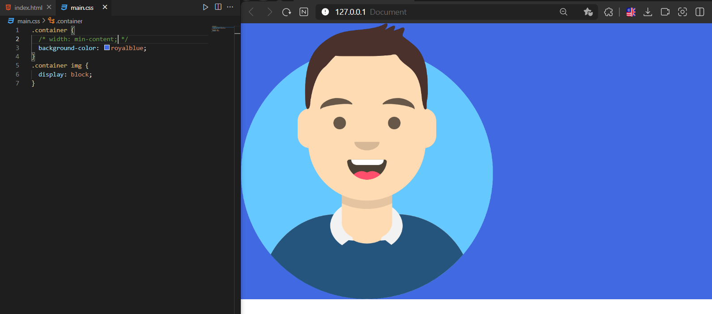
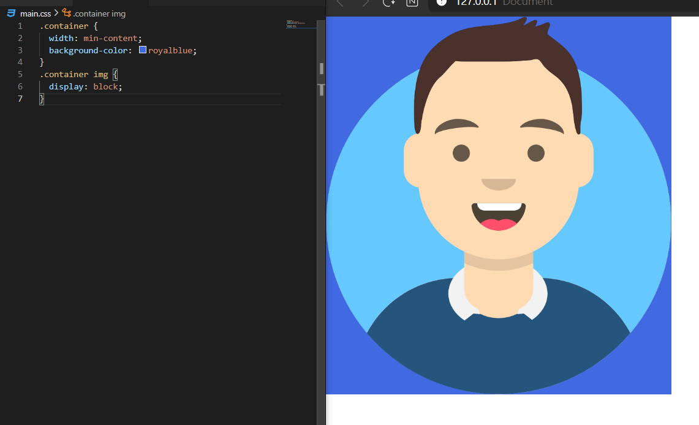


# **Transition (전환 효과)**

```css
/* 전환의 지속시간을 의미한다 */
transition-duration: 1s;

/* 전환의 대상을 의미한다 */
transition-property: all;

/* 전환되는 타이밍의 함수를 의미한다 */
transition-timing-function: ease;

/* 전환의 지연시간을 의미한다 */
transition-delay: 0s;

/* 기재된 값은 기본값이다 */
```
<br>
<br>

## **주의할 점**

전환 효과는 중복으로 부여하면 안 된다

```css
 .container img {
  transition-duration: .8s;
 }
 .container:hover img {
  transition-duration: .8s;
  transform: rotate(45deg);
 }
```

이런 형식으로 전환 효과를 중복으로 부여하게 되면 에러가 발생할 수 있다

중복으로 부여하지 말자

전환 효과는 가상 클래스가 아닌, 원본 선택자에 부여해야 한다

예를 들어 전환 효과가 :hover에만 적용되어 있다면 전환이 들어가는 시점은 마우스가 올라가는 시점이 된다

전환 중에 마우스를 떼 버리면 전환이 불완전하게 마무리가 돼버린다

```css
 .container img {
  transition-duration: .8s;
 }
 .container:hover img {
  transform: rotate(45deg);
 }
```

이런 형식으로, 전환 효과는 반드시 가상 클래스 선택자 부분이 아닌, 원본 부분에 적용하자! 꼭 기억할 것
<br>
<br>


# **Transform (변환 효과)**

transform 같은 경우 변환 함수를 한 번에 여러 개 작성할 수 있다

주의할 점은 변환 함수를 작성할 때는, perspective함수를 가장 앞에 적어주어야 한다

```css
.container:hover img {
  transform: perspective(400px) rotateX(45deg) scale(1.1);
}
```

이런 형태로 작성해주어야 한다
<br>
<br>

## **transform-origin**

변환 효과의 기준이 어디인지 설정하는 속성

기본값은 (50%, 50%)로, 정 가운데를 의미한다(x축, y축)

\*web에서 축의 시작은 화면 왼쪽 위다 (왼쪽 아래가 아니다)

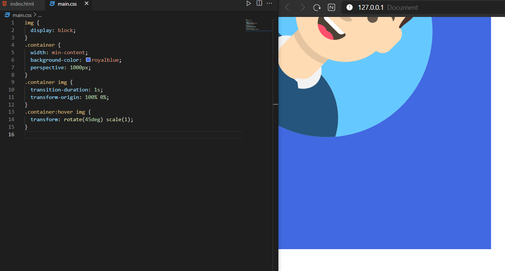

x축 기준 100%, y축 0%이기 때문에, 이미지 박스 오른쪽 최상단을 기준으로 45도 회전한 걸 확인할 수 있다

여기서도 주의할 점은 해당 속성 또한 가상 클래스가 아닌 이미지 자체에 속성을 부여하여, 기준 자체가 처음부터 있을 수 있도록 만들어 주어야 한다
<br>
<br>

## **transform-style**

3D 효과 안에 효과가 또 적용되면, 내용은 날아간다

즉 부모 요소에도 3D 효과가 적용되고, 자식 요소에도 3D 효과가 적용된다면, 자식 요소에 적용된 효과는 적용되지 않는다

3D 효과의 자식들도 효과가 적용되도록 따로

그 속성은 바로 transform-style이고 기본값은 flat이다

preverse-3d로 하면 자식의 3D 효과를 말 그래도 보존해준다

```css
 /* 기본값 */
transform-style : flat

 /* 자식요소도 3D 효과 적용 */
transform-style : preverse-3d
```
<br>
<br>


# **Animation**

```css
.container img {
  transition-duration: 0s;
  
   /* 이름 지정 */
  animation-name: rolling;
  
   /* 지속시간 */
  animation-duration: 0s;
  
   /* 지연시간 */
  animation-delay: 0s;
  
   /* 반복횟수 */
  animation-iteration-count: 1;
  
   /* 타이밍 함수 */
  animation-timing-function: ease;
  
   /* 방향 */
   /* 편도로 움직인다 */
  animation-direction: normal;
  
   /* 반대부터 편도로 움직인다 */
  animation-direction: reverse;
  
   /* 왕복운동 한다 */
  animation-direction: alternate;
  
   /* 반대부터 왕복운동하는 움직인다 */
  animation-direction: alternate-reverse;

}
.container:hover img {
  transform: rotateY(45deg);
  
   /* 플레이의 상태 */
  animation-play-state: paused;
}


 /* 해당 프레임은 0%에서 100%으로 가면서 X축 방향으로 100px 이동한다 */
 /* 0%과 100%사이에 어떤 숫자던지 들어 갈 수 있다 */

@keyframes rolling {
  0% {
    transform: translateX(0);
  }
  100% {
    transform: translateX(100px);
  }
```

애니메이션 관련 속성은, 애니메이션 관련 동작을 제어하는 속성이다! 이게 핵심이다.

실제 애니메이션을 만들려면 @keyfames이 필요하다

이 프레임들을 애니메이션 속성으로 제어해서 애니메이션을 만드는 것이다

css는 순서대로 반영되는 게 아니라, 전체를 한 번에 반영하는 것이다! (그래서 선택자 우선순위가 존재하는 것이다!)

때문에, 애니메이션 프레임을 밑에다 적어도 문제가 없다

\*단축 속성을 써버리면, 모르는 입장에서는 모르기 때문에

조금 더 직관성을 위해 단축 속성을 안 쓰는 것을 생각해볼 수 있다
<br>
<br>

## **animation-fill-mode**

fill-mode는 요소의 애니메이션이 어디에서 시작해서 어떻게 동작해서 어떻게 끝날지 생각하면 된다

주로 none이나, both를 쓴다. 즉, 안 쓰거나 both만 쓰게 될 것이다

fill-mode는 전후 상태라고 생각하면 된다 

none은 기존 위치에서 시작해서, 애니메이션 시작 위치로 이동 후, 동작 한 다음, 기존 위치에서 끝난다

both는 기존 위치를 무시하고, 애니메이션 시작 위치에서 시작 후, 동작 한 다음, 애니메이션 끝 위치에서 끝난다
<br>
<br>


# **다단 만들기**

```css
.container {
  padding: 20px;
  border: 4px solid;
  
   /* 단의 최종 개수 */
  column-count: 10;
  
   /* 각 단의 최종 너비 */
  column-width: 100px;
  
   /* 단 사이의 여백 */
  column-gap: 200px;
  
   /* border와 같은 선 */
  column-rule: 1px solid red;
}
```

단의 개수를 설정한다고 해서, 단이 원하는 대로 다 만들어지는 건 아니다!

내가 설정하는 건 최대 개수이다!

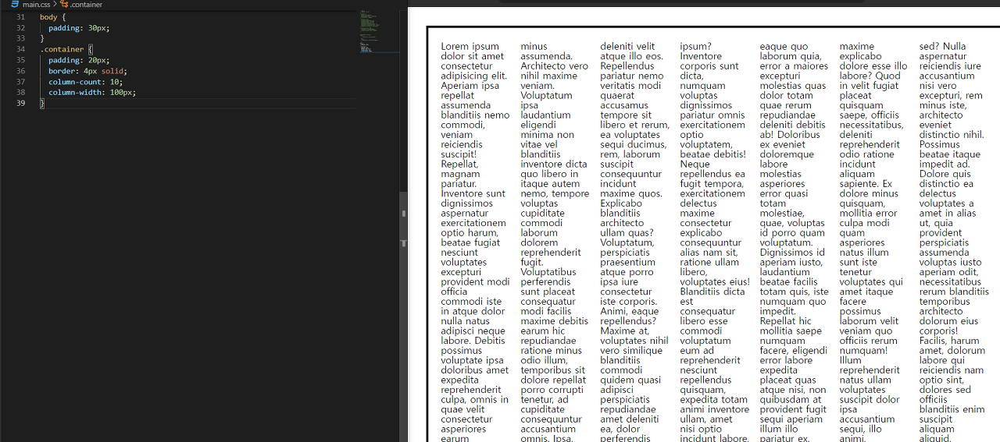

단의 개수를 10으로 설정했지만,

브라우저가 알아서 최적화를 시킨 걸 확인할 수 있다!

결론은 브라우저가 알아서 최적화를 시킨다를 아는 것이 가장 중요하다!!

단의 최종 너비와 최종 개수를 지정만 할 수 있다
<br>
<br>


# **Filter**

```css
.container {
  filter: blur();
  filter: brightness();
  filter: contrast();
  filter: drop-shadow();
  filter: grayscale();
  filter: hue-rotate();
  filter: invert();
  filter: opacity();
  filter: saturate();
  filter: sepia();
}
```

모든 속성이 다 많이 쓰이는 것은 아니다

blur, grayscale, invert정도만 잘 이해하면 된다
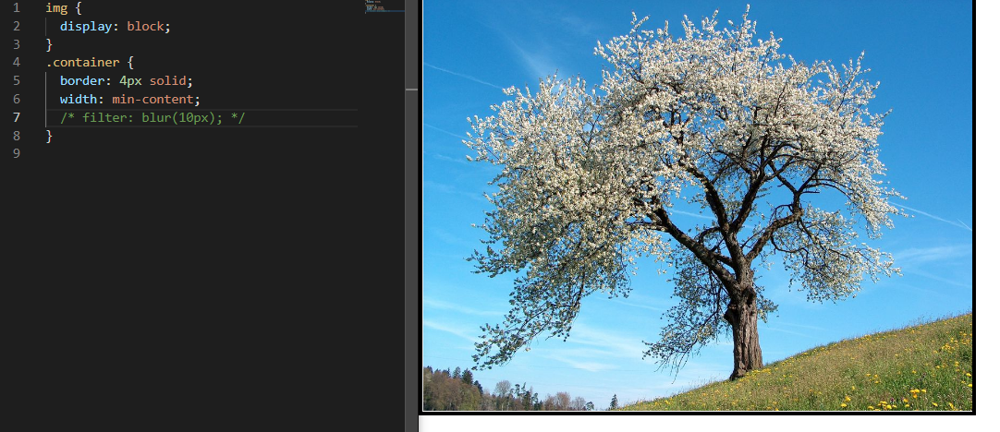
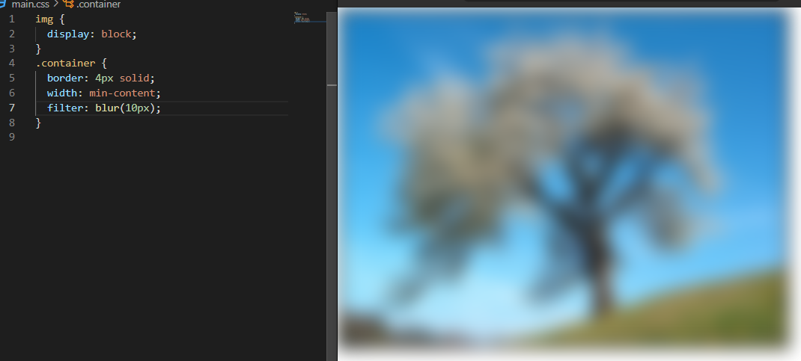

blur - 흐림 처리
<br>
<br>

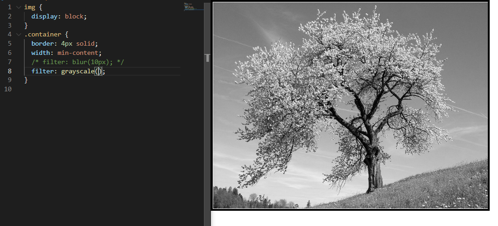

grayscale - 기본값이 100%이다
<br>
<br>

많이 쓰는 속성은 blur, grayscale, invert(반전 효과) 정도이다

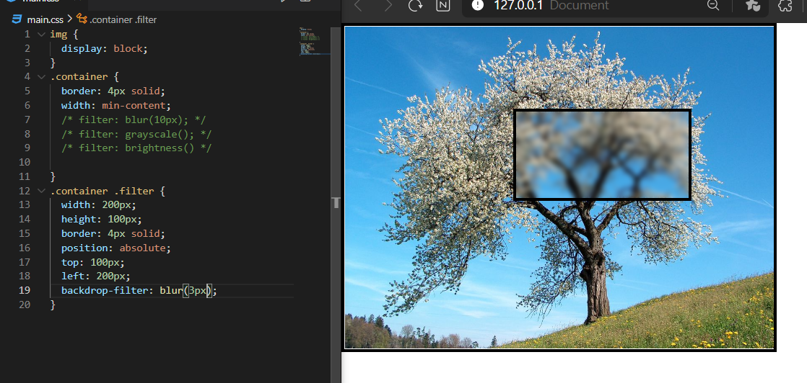


backdrop-filter는 필터에서 쓸 수 있는 속성이 들어갈 수 있는데, 해당 부분이 필터가 적용되는 것이다
<br>
<br>

# **grid**

flex와 같이 grid도 grid-container, grid-items로 나뉜다

flex는 1차원의 레이아웃, grid는 2차원의 레이아웃이다
<br>
<br>

## **grid-template-columns,** **grid-template-rows**

```css
.container {
  display: gird;
  grid-template-columns: 1fr 1fr 1fr;
  grid-template-rows: 1fr 1fr 1fr;
}
```

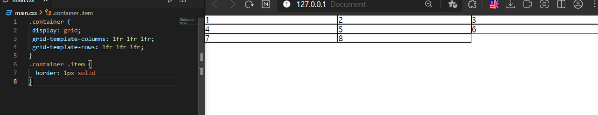


이렇게 하면 3행 3열이 만들어진다

grid를 만들면 가장 먼저 해야 하는 것은 이렇게 rows와 columns의 개수를 정해서 만들어 주는 것이다

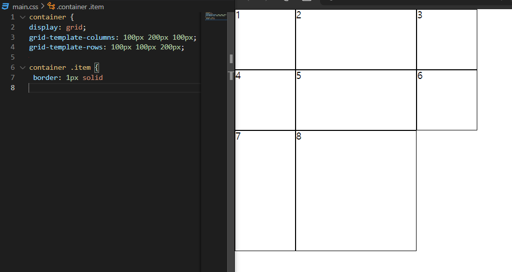


grid에서는 비율단위로 fr(fraction)을 사용한다

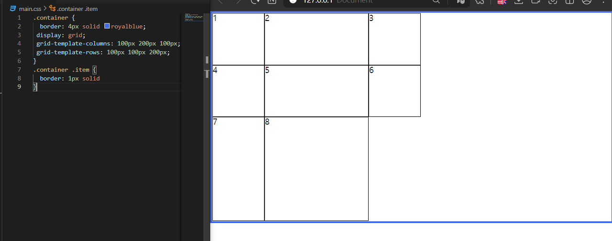
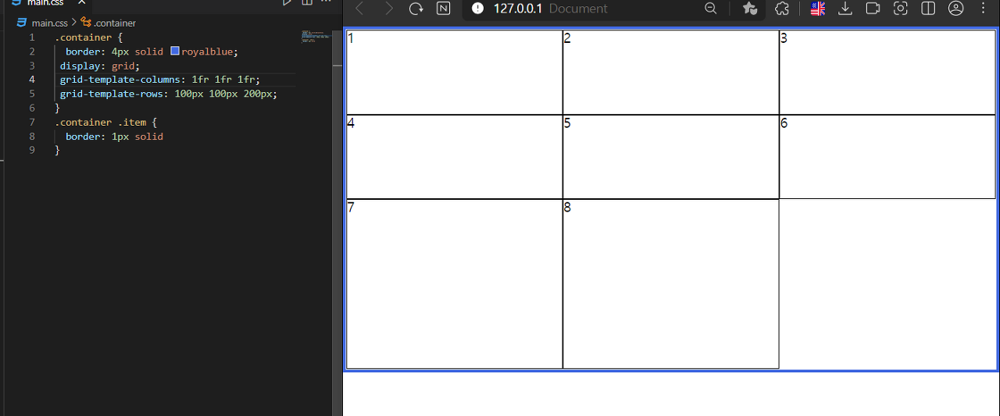


비율 단위를 사용하게 되면 이렇게 여백이 없어진다

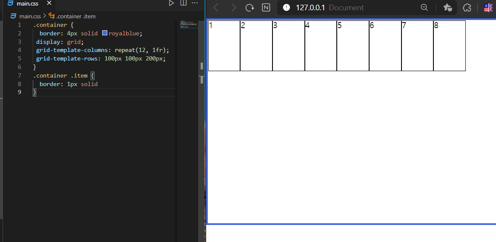


repeat(만들 개수, 비율)를 사용하면 편하게 만들 수 있다

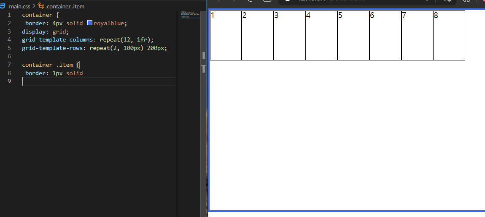


이렇게 repeat와 다른 비율을 섞을 수 있지만, 이렇게는 잘 안한다

중요한 건, 각각의 아이템이 하나도 없어도, grid 시스템은 유지되고 있다

하나의 방을 cell이라고 하는데, 해당 cell이 채워져있지 않을 뿐이지 존재하고 있다

개발자 도구에서 컨테이너 요소를 보면 확인할 수 있다
<br>
<br>

## **Track, Line, Cell, Area**

트랙(Track)은 하나의 행 혹은 하나의 열을 의미한다

라인(Line)은 일반적으로 거터(Gutter)라고 하는 트랙과 트랙사이의 여백(간격)을 의미한다

셀(cell)은 하나의 칸을 의미한다, 아이템이 아니다! 아이템이 배치되는 하나의 공간이 셀이다!!

영역(Area)은 셀 여러개를 의미한다
<br>
<br>

## **gap**

```css
.container {
  gap: 10px 20px;
}
```

항상 말할 때, 행과 열 순서로 말하는 걸 상기해보면 된다

gap 단축 속성의 순서는 (row사이의 간격) (column사이의 간격)을 의미한다

flex에서도 gap속성을 사용할 수 있기 때문에 grid-gap으로 쓰지 않고, gap이라고 적는다!
<br>
<br>

## **span**

grid에서 span은 확장의 의미를 가진다

```css
.item:nth-child(2) {
  grid-column: span 2;
}
```

이런 경우 아이템 2번의 column이 차지하는 공간은 2가 된다

즉 grid-column 방향으로 두 개의 셀을 점유하게 된다

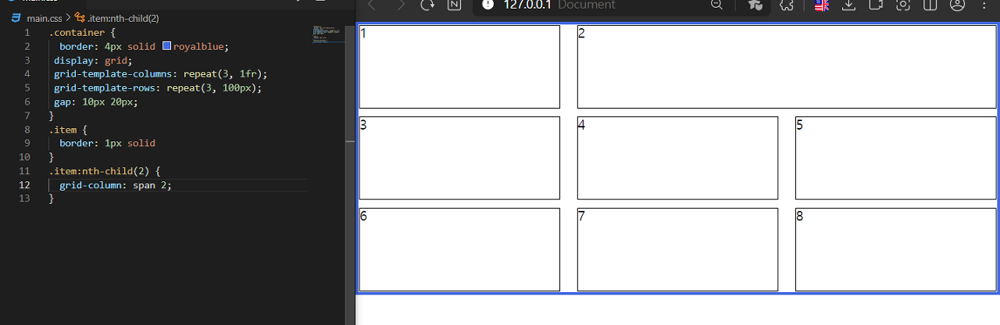

앞 서 말했듯이, grid는 container와 items 구조로 만들어서, 현재 container를 몇 행의 몇 열의 grid 구조로 만들 것인지 정의하는 것이 첫 번째 단계이고, 그다음은 그 구조 안에서 여러 가지 아이템을 배열하는 것이 핵심 개념이다!
<br>
<br>

## **grid-auto-rows/columns**

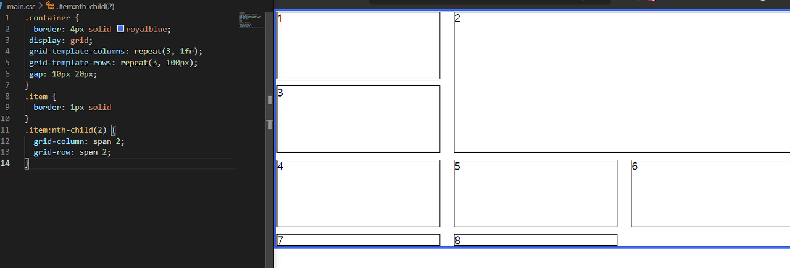


7, 8번 아이템이 잘리는 문제가 발생한다

실제로 잘린 것은 아니고, 높이값은 어떤 상황에서 던 지 항상 줄어들으려고 하기 때문에, 요소의 크기만큼 줄어든 것이다

이러한 상황을 막기 위해서

```css
.container {
 grid-auto-rows: 100px;
}
```

이렇게 적용하면, 넘치는 요소의 처리를 지정할 수 있다

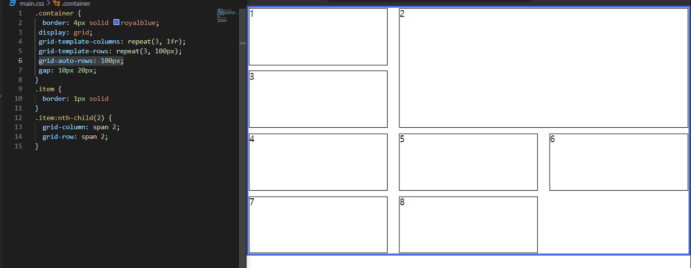


이러한 이유로, rows 같은 경우 template 속성은 잘 쓰지 않고, auto를 많이 사용한다

template -> 명시적으로 행과 열을 지정

auto -> 암시적으로 행과 열을 지정

이렇게 생각하면 된다
<br>
<br>

## **grid-auto-flow**

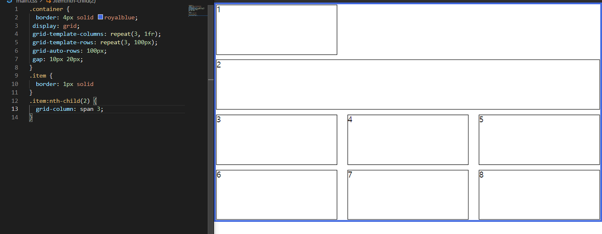


1번 아이템 옆으로 빈 공간이 있는 걸 볼 수 있다

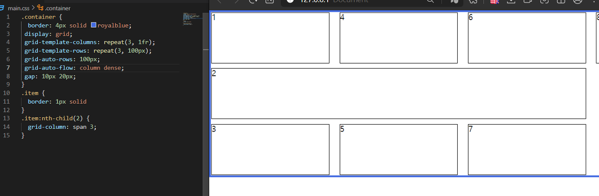

```css
.container {
  grid-auto-flow: column dense;
}
```

이렇게 지정하면, column 방향으로 돌아가다가, dense(빽빽한, 밀집) 속성으로 인해 채워진 것이다

row dense 같은 경우, 앞에 row를 생략하여 dense만 적어도 된다
<br>
<br>

## **grid-row/column: 숫자 / 숫자;**

각각의 line에는 번호가 있고, 이런 식으로 배치할 수 있다


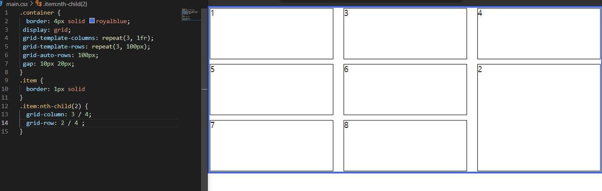


2번 아이템이

column 기준 3번째에서 시작해서 4번째 라인에서 끝나는 cell을 점유하였고,

row 기준 2번째에서 시작해서 4번째 라인에서 끝나는 cell을 점유하였다

이렇게 자리를 옮길 수 있다
<br>
<br>

## **Z-index**

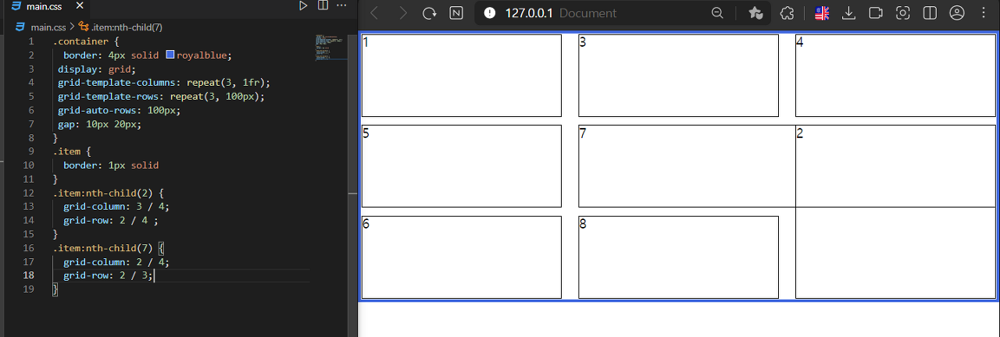

이렇게 하면 중첩이 되는데

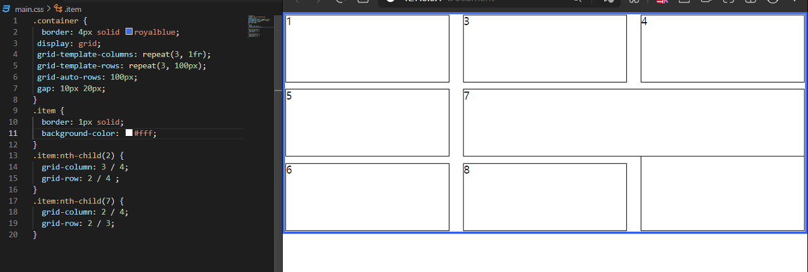

나중에 작성된 아이템이 더 나중에 쌓여서 위에 나온 걸 볼 수 있다

즉 2번 아이템보다 7번 아이템이 더 나중에 쌓인 것이므로, 올라와있지만,

z-index를 사용하면 2번 아이템을 7번 아이템 위로 올릴 수 있다
<br>
<br>

## **order**

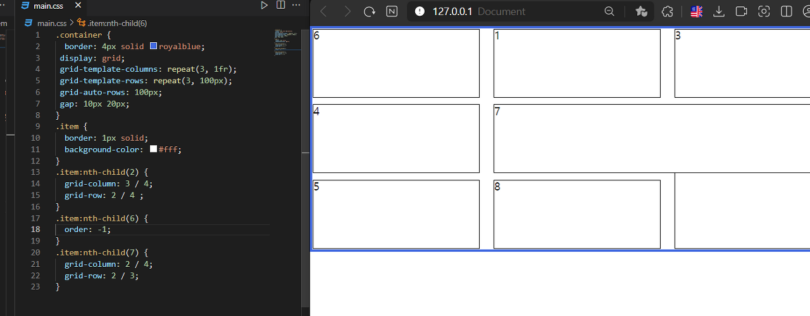


6번째 아이템에 order: -1을 넣었더니, 가장 앞으로 배치된 걸 볼 수 있다

order는 숫자가 작을수록 우선순위가 높다

기본값은 0이다
<br>
<br>

# @media

```css
/* 기본적인 형식 */
/* @media (타입) and (속성) */
/* 타입 부분은 기본값이 all 이고, 생략 가능 */
@media screen and (max-width: 600px) {
  
}

@media (max-width: 600px) {
    .box {
      width: 300px;
      background-color: royalblue;
    }
}

/* 기능을 확장할 수도 있다 */
/* not을 사용할 때는 타입을 명시해야한다 */
@media not all and (min-width: 600px) and (max-width: 800px) {
    .box {
      width: 300px;
      background-color: royalblue;
    }
}
```
위의 기능 확장의 경우, 범위가 너비 600~800px사이에서가 조건인데, 

앞에 not이 붙어있으므로, 해당 범위를 제외한 부분에서 너비가 300px, 배경색상이 royalblue값이 적용된다
<br>
<br>

```css
/* 뷰포트의 세로너비가 길 때 적용 */
@media (orientation: portrait) {

}

/* 뷰포트의 가로너비가 길 때 적용 */
@media (orientation: landscape) {

}
```
<br>
<br>

# 변수

```css
  /* 보통 색상 변수는 primary에 선언한다 */
html {
  --primary: orange
}
.group1 {
  --danger: green;
}

/* css 변수는 var 함수 안에 넣어서 사용한다 */
.box {
  width: 100px;
  height: 100px;
  background-color: var(--primary);
}

/* 변수는 유효범위 안에서만 적용된다 */
/* 아래의 경우, danger의 선언부는 .group1 이므로, 적용되지 않는다. 이럴 때, default parameter 값을 넣어 줄 수 있다*/
.box {
  width: 100px;
  height: 100px;
  background-color: var(--danger, red);
}